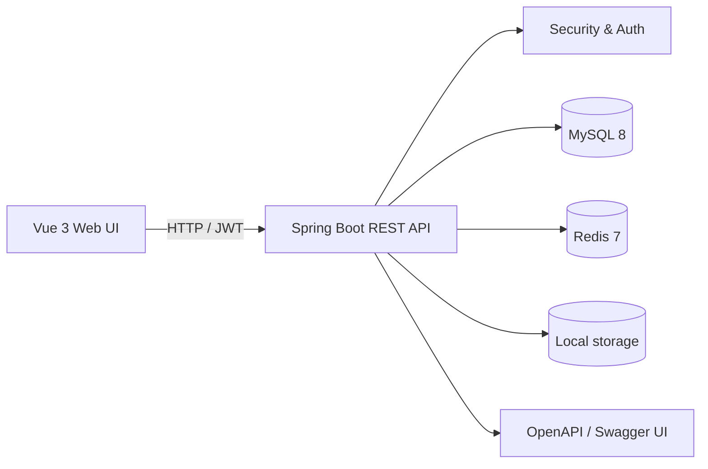
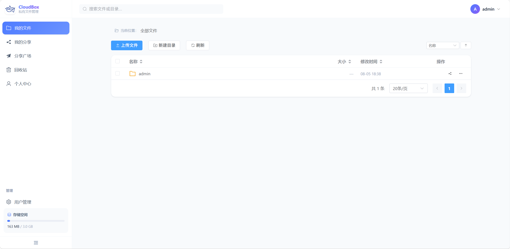
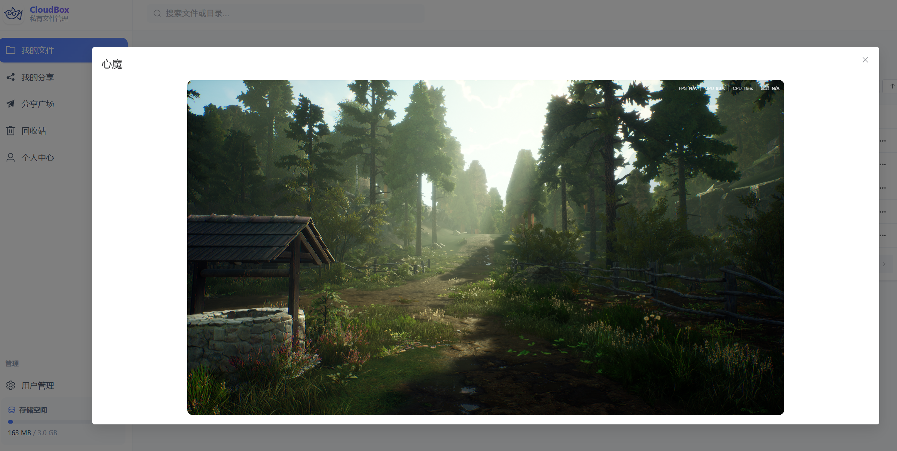
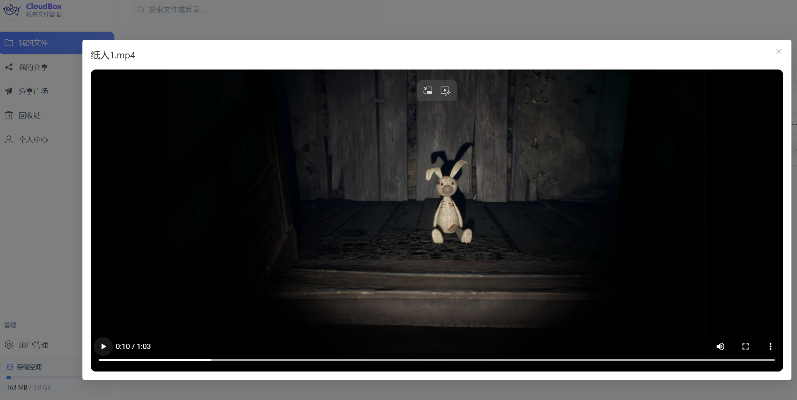

<p align="center">
  
</p>

<h1 align="center">CloudBox</h1>

<p align="center">
  私有文件管理与分享系统 · Private file management and sharing
</p>

<p align="center">
  <a href="#中文说明"></a>
  <a href="#english"></a>
  
  
  
  
  
  
  
  
</p>

<p align="center">
  <a href="#快速开始">快速开始</a> ·
  <a href="#功能">功能</a> ·
  <a href="#项目结构">项目结构</a> ·
  <a href="#quick-start">Quick start</a>
</p>

## 中文

CloudBox 是一个前后端分离的私有文件管理与分享系统，面向个人和小团队提供清晰、可靠的文件工作流。它支持目录管理、文件上传下载、在线预览、回收站和安全分享，并通过 JWT、Redis 和细粒度权限控制保护用户数据。

项目采用单仓库结构：Spring Boot 提供 REST API，Vue 3 提供管理界面，文件内容默认保存在本地磁盘，MySQL 保存业务元数据，Redis 负责令牌、分享票据和限流等短期状态。

### 功能

| 模块 | 能力 |
| --- | --- |
| 账户与安全 | 注册、登录、退出、JWT Access Token、Refresh Token 自动刷新、并发刷新保护、请求限流 |
| 我的文件 | 目录树浏览、面包屑导航、新建目录、重命名、移动、复制、批量操作和详情查看 |
| 上传与预览 | 多选/拖拽上传、进度反馈、基于 SHA-256 的文件复用、文件下载，以及图片、PDF、纯文本和视频预览 |
| 分享 | 创建文件或目录分享，支持访问口令、有效期和下载次数限制；可复制分享链接并随时取消 |
| 分享广场 | 浏览公开分享，访问受保护内容，并在权限校验后下载或预览文件 |
| 回收站 | 软删除、恢复、彻底删除和清空回收站，避免误删造成数据丢失 |
| 个人中心 | 查看和修改资料、修改密码、查看存储配额与已用空间 |
| 管理员 | 用户列表、启用/禁用用户、调整用户存储配额 |

### 技术栈

| 层次 | 技术 |
| --- | --- |
| 后端 | Java 21、Spring Boot 3.5、Spring Web、Validation、Actuator |
| 认证与安全 | Spring Security 6、JJWT 0.12、基于角色的访问控制 |
| 数据访问 | MyBatis-Plus、Flyway、MySQL 8 |
| 缓存与状态 | Spring Data Redis、Redis 7、Lua 原子脚本 |
| 前端 | Vue 3、TypeScript、Vite、Vue Router 4、Pinia、Element Plus、Axios |
| API 文档 | springdoc OpenAPI / Swagger UI |
| 文件存储 | 本地文件系统；通过存储服务抽象为后续接入对象存储预留空间 |
| 测试 | Spring Boot Test、Spring Security Test、Testcontainers（MySQL） |

### 架构概览



### 环境要求

- JDK 21 或更高版本
- Maven 3.9+，或使用项目内置 Maven Wrapper
- Node.js 18+ 和 npm 9+
- MySQL 8+
- Redis 7+

### 快速开始

#### 1. 准备基础服务

创建数据库 `z-file`，启动 MySQL 和 Redis。开发环境连接信息位于 `src/main/resources/application-local.yaml`，请根据本机环境修改账号、密码和地址。

#### 2. 启动后端

在仓库根目录执行：

```bash
# macOS / Linux
./mvnw spring-boot:run

# Windows PowerShell
.\mvnw.cmd spring-boot:run
```

后端默认地址为 `http://localhost:8090`，API 基础路径为 `/api/v1`。数据库表会由 Flyway 在应用启动时自动迁移。

#### 3. 启动前端

```bash
cd frontend
npm install
npm run dev
```

前端默认地址为 `http://localhost:5173`。Vite 会把 `/api` 请求代理到 `http://localhost:8090`，代理地址可在 `frontend/vite.config.ts` 中调整。

#### 4. 构建与测试

```bash
# 前端类型检查与生产构建
cd frontend
npm run build

# 回到仓库根目录运行后端测试
cd ..
./mvnw test
```

Swagger UI 默认地址为 `http://localhost:8090/swagger-ui/index.html`，OpenAPI 文件位于 `frontend/cloudbox-openapi.yaml`。

### 项目结构

```text
z-file/
├── src/                         # Spring Boot 后端源码
│   ├── main/java/com/pei/zfile/ # 认证、文件、分享、回收站和管理模块
│   └── main/resources/          # 配置、Flyway 迁移、Redis Lua 脚本
├── frontend/                    # Vue 3 + TypeScript + Vite 前端
│   ├── src/api/                 # Axios 请求与 API 封装
│   ├── src/views/               # 登录、文件、分享、回收站和管理页面
│   └── public/                  # Logo 与静态资源
├── storage/                     # 本地文件存储目录（运行时生成）
├── pom.xml                      # Maven 配置
└── README.md
```

### 项目部分效果演示
#### 首页


#### 内联图片预览



#### 内联视频预览



### API 与安全说明

- 登录接口位于 `/api/v1/auth/**`，其余资源按用户归属和角色进行授权。
- Refresh Token 保存在 Redis 中，退出登录后会立即失效。
- 分享口令只保存哈希值；分享访问会校验口令、有效期、节点状态和下载次数。
- 文件物理名称使用随机存储键，与用户提交的原始文件名隔离。
- 生产环境请替换 `JWT_SECRET`、数据库密码、Redis 密码和本地存储路径，并通过环境变量或安全配置中心注入。

### 配置入口

| 配置 | 默认值/位置 | 说明 |
| --- | --- | --- |
| 后端端口 | `8090` | 可在 `src/main/resources/application.yaml` 覆盖 |
| 前端端口 | `5173` | 可在 `frontend/vite.config.ts` 调整 |
| 数据库与 Redis | `application-local.yaml` | 本地开发配置，提交前请替换敏感信息 |
| 文件目录 | `z-file.storage.local-path` | 默认使用仓库下的 `storage/` |
| JWT 密钥 | `JWT_SECRET` | 未设置时仅生成随机开发密钥 |

## English

CloudBox is a full-stack private file management and sharing system for individuals and small teams. It provides a focused workflow for folders, uploads, downloads, previews, recycle-bin recovery and secure sharing, with JWT authentication, Redis-backed state and fine-grained authorization.

The repository is organized as a monorepo: Spring Boot exposes the REST API, Vue 3 powers the web console, local disk stores file content by default, MySQL stores metadata, and Redis handles short-lived state such as refresh tokens, share tickets and rate limits.

### Features

| Area | Capabilities |
| --- | --- |
| Account & security | Registration, login, logout, JWT access tokens, refresh-token rotation, concurrent refresh protection and rate limiting |
| My files | Folder tree, breadcrumbs, folder creation, rename, move, copy, batch actions and metadata details |
| Upload & preview | Multi-file/drag-and-drop uploads, progress feedback, SHA-256 based file reuse, downloads, plus image, PDF, text and video previews |
| Sharing | Share files or folders with passwords, expiration times and download limits; copy or revoke links at any time |
| Share square | Browse public shares and download or preview protected content after access checks |
| Recycle bin | Soft delete, restore, permanent delete and empty-trash operations |
| Profile | Update profile data and password, and view storage quota and usage |
| Administration | List users, enable/disable accounts and adjust storage quotas |

### Technology

| Layer | Technology |
| --- | --- |
| Backend | Java 21, Spring Boot 3.5, Spring Web, Validation and Actuator |
| Auth & security | Spring Security 6, JJWT 0.12 and role-based access control |
| Persistence | MyBatis-Plus, Flyway and MySQL 8 |
| Cache & state | Spring Data Redis, Redis 7 and Lua atomic scripts |
| Frontend | Vue 3, TypeScript, Vite, Vue Router 4, Pinia, Element Plus and Axios |
| API docs | springdoc OpenAPI / Swagger UI |
| File storage | Local filesystem behind a storage service abstraction, ready for a future object-storage adapter |
| Testing | Spring Boot Test, Spring Security Test and Testcontainers for MySQL |

### Quick start

#### Prerequisites

- JDK 21+
- Maven 3.9+ or the included Maven Wrapper
- Node.js 18+ and npm 9+
- MySQL 8+
- Redis 7+

#### 1. Start MySQL and Redis

Create a database named `z-file`, then start MySQL and Redis. Update `src/main/resources/application-local.yaml` with the credentials and addresses for your environment.

#### 2. Run the backend

```bash
# macOS / Linux
./mvnw spring-boot:run

# Windows PowerShell
.\mvnw.cmd spring-boot:run
```

The backend listens on `http://localhost:8090` by default, with `/api/v1` as the API base path. Flyway applies database migrations during startup.

#### 3. Run the frontend

```bash
cd frontend
npm install
npm run dev
```

Open `http://localhost:5173`. The Vite development server proxies `/api` to `http://localhost:8090`; change the target in `frontend/vite.config.ts` when needed.

#### 4. Build and test

```bash
# Frontend type-check and production build
cd frontend
npm run build

# Backend tests from the repository root
cd ..
./mvnw test
```

Swagger UI is available at `http://localhost:8090/swagger-ui/index.html`. The checked-in OpenAPI description is `frontend/cloudbox-openapi.yaml`.

### Partial Project Effect Demonstration
#### Home


#### Inline Image Preview


#### Inline Video Preview


### Security notes

- Login endpoints live under `/api/v1/auth/**`; other resources are authorized by ownership and role.
- Refresh tokens are stored in Redis and revoked on logout.
- Share passwords are stored as hashes. Share access checks the password, expiration, node state and download limit.
- Physical file names use random storage keys and are separated from user-provided names.
- Replace `JWT_SECRET`, database credentials, Redis credentials and the storage path in production. Inject secrets through environment variables or a secure configuration service.

### Repository layout

```text
z-file/
├── src/                         # Spring Boot backend
│   ├── main/java/com/pei/zfile/ # auth, files, sharing, trash and admin modules
│   └── main/resources/          # config, Flyway migrations and Redis scripts
├── frontend/                    # Vue 3 + TypeScript + Vite frontend
│   ├── src/api/                 # Axios request and API modules
│   ├── src/views/               # auth, files, sharing, trash and admin views
│   └── public/                  # logo and static assets
├── storage/                     # runtime local file storage
├── pom.xml                      # Maven configuration
└── README.md
```
